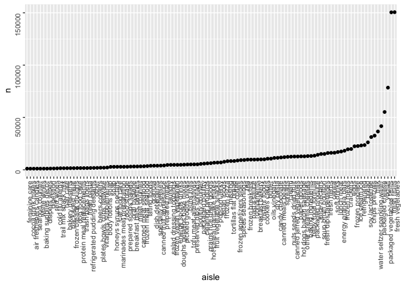
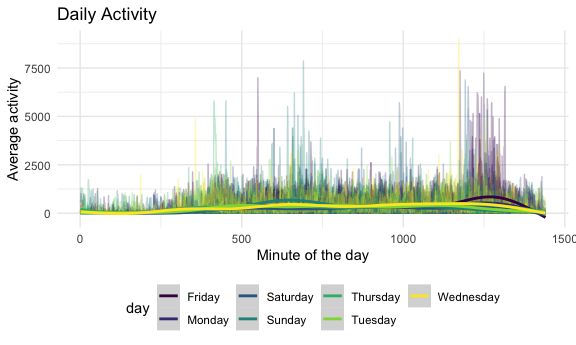

p8105\_hw3\_amw2275
================
Adam Whalen
10/10/2020

``` r
library(tidyverse)
```

    ## ── Attaching packages ─────────────────────────────────────────────────── tidyverse 1.3.0 ──

    ## ✓ ggplot2 3.3.2     ✓ purrr   0.3.4
    ## ✓ tibble  3.0.3     ✓ dplyr   1.0.2
    ## ✓ tidyr   1.1.2     ✓ stringr 1.4.0
    ## ✓ readr   1.3.1     ✓ forcats 0.5.0

    ## ── Conflicts ────────────────────────────────────────────────────── tidyverse_conflicts() ──
    ## x dplyr::filter() masks stats::filter()
    ## x dplyr::lag()    masks stats::lag()

``` r
library(viridis)
```

    ## Loading required package: viridisLite

``` r
knitr::opts_chunk$set(
    fig.width = 6, 
  fig.asp = .6,
  out.width = "90%"
)
theme_set(theme_minimal() + theme(legend.position = "bottom"))
options(
  ggplot2.continuous.colour = "viridis",
  ggplot2.continuous.fill = "viridis"
)
scale_colour_discrete = scale_colour_viridis_d
scale_fill_discrete = scale_fill_viridis_d
```

## Problem 1

``` r
library(p8105.datasets)
data("instacart")
```

This data set contains 1384617 rows and 15 columns. Observations are the
level of items in orders by user. There are user/order variables: user
ID, order ID, order day, and order hour. There are also item variables:
name, aisle, department, and some numeric codes.

How many aisles, and which are most items from?

``` r
instacart %>% 
  count(aisle) %>% 
  arrange(desc(n))
```

    ## # A tibble: 134 x 2
    ##    aisle                              n
    ##    <chr>                          <int>
    ##  1 fresh vegetables              150609
    ##  2 fresh fruits                  150473
    ##  3 packaged vegetables fruits     78493
    ##  4 yogurt                         55240
    ##  5 packaged cheese                41699
    ##  6 water seltzer sparkling water  36617
    ##  7 milk                           32644
    ##  8 chips pretzels                 31269
    ##  9 soy lactosefree                26240
    ## 10 bread                          23635
    ## # … with 124 more rows

Let’s make a plot\!

``` r
instacart %>% 
  count(aisle) %>% 
  filter(n > 1000) %>% 
  mutate(
    aisle = factor(aisle),
    aisle = fct_reorder(aisle, n)
  ) %>% 
  ggplot(aes(x = aisle, y = n))+
  geom_point() +
  theme(axis.text = element_text(angle = 90, vjust = 0.5, hjust = 1))
```



Let’s make a table\!

``` r
instacart %>% 
  filter(aisle %in% c("baking ingredients", "dog food care", "packaged vegetables fruits")) %>% 
  group_by(aisle) %>% 
  count(product_name) %>% 
  mutate(rank = min_rank(desc(n))) %>% 
  filter(rank < 4) %>% 
  arrange(aisle, rank) %>% 
  knitr::kable()
```

| aisle                      | product\_name                                 |    n | rank |
| :------------------------- | :-------------------------------------------- | ---: | ---: |
| baking ingredients         | Light Brown Sugar                             |  499 |    1 |
| baking ingredients         | Pure Baking Soda                              |  387 |    2 |
| baking ingredients         | Cane Sugar                                    |  336 |    3 |
| dog food care              | Snack Sticks Chicken & Rice Recipe Dog Treats |   30 |    1 |
| dog food care              | Organix Chicken & Brown Rice Recipe           |   28 |    2 |
| dog food care              | Small Dog Biscuits                            |   26 |    3 |
| packaged vegetables fruits | Organic Baby Spinach                          | 9784 |    1 |
| packaged vegetables fruits | Organic Raspberries                           | 5546 |    2 |
| packaged vegetables fruits | Organic Blueberries                           | 4966 |    3 |

Apples vs ice cream:

``` r
instacart %>% 
  filter(product_name %in% c("Pink Lady Apples", "Coffee Ice Cream")) %>% 
  group_by(product_name, order_dow) %>% 
  summarize(mean_hour = mean(order_hour_of_day)) %>% 
  pivot_wider(
    names_from = order_dow,
    values_from = mean_hour
  )
```

    ## `summarise()` regrouping output by 'product_name' (override with `.groups` argument)

    ## # A tibble: 2 x 8
    ## # Groups:   product_name [2]
    ##   product_name       `0`   `1`   `2`   `3`   `4`   `5`   `6`
    ##   <chr>            <dbl> <dbl> <dbl> <dbl> <dbl> <dbl> <dbl>
    ## 1 Coffee Ice Cream  13.8  14.3  15.4  15.3  15.2  12.3  13.8
    ## 2 Pink Lady Apples  13.4  11.4  11.7  14.2  11.6  12.8  11.9

## Problem 2

Import, clean, and wrangle the data set.

``` r
accel_df = 
  read_csv("data/accel_data.csv") %>% 
  janitor::clean_names() %>% 
  mutate(
    day = as.factor(day)
  ) %>% 
  pivot_longer(
    activity_1:activity_1440,
    names_to = "minute",
    names_prefix = "activity_",
    values_to = "activity"
  ) %>% 
  mutate(
    weekday = if_else(day %in% c("Saturday", "Sunday"), "TRUE", "FALSE"),
    weekday = as.factor(weekday),
    minute = as.numeric(minute)
  ) %>% 
  relocate(week, day_id, day, weekday)
```

    ## Parsed with column specification:
    ## cols(
    ##   .default = col_double(),
    ##   day = col_character()
    ## )

    ## See spec(...) for full column specifications.

The accelerometer data set includes 50400 observations, which represent
minutes of the day, and 6 variables, including activity counts and day
of the week. It describes 5 weeks of activity data from an accelerometer
worn by one patient, capturing activity each minute.

Aggregate activity data across days.

``` r
accel_agg = 
  accel_df %>% 
  group_by(day) %>% 
  summarize(total = sum(activity)) 
```

    ## `summarise()` ungrouping output (override with `.groups` argument)

``` r
accel_agg %>% knitr::kable()
```

| day       |   total |
| :-------- | ------: |
| Friday    | 2291711 |
| Monday    | 1858699 |
| Saturday  | 1369237 |
| Sunday    | 1919213 |
| Thursday  | 2091151 |
| Tuesday   | 1799238 |
| Wednesday | 2129772 |

It seems that the days with the highest total activity are Wednesday,
Thursday, and Friday. Saturday has the lowest activity, perhaps due to
the patient relaxing on the weekend.

Create a plot to show activity data by day.

``` r
accel_df %>% 
  ggplot(aes(x = minute, y = activity, group = day_id, color = day)) +
  geom_line(alpha = 0.3) +
  geom_smooth(aes(group = day)) +
  labs(
    title = "Daily Activity",
    x = "Minute of the day",
    y = "Average activity"
  )
```

    ## `geom_smooth()` using method = 'gam' and formula 'y ~ s(x, bs = "cs")'



This plot shows the average activity for each minute, grouped by day.
Notably, there is a small increase in activity for Thursdays between
roughly 8 and 10 AM, and a spike on Fridays between roughly 8 PM and 10
PM.

## Problem 3
